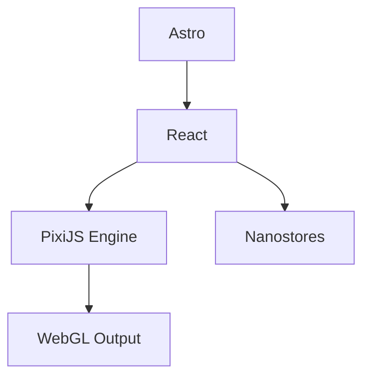

https://github.com/user-attachments/assets/81657547-a143-44ee-b8d7-d5f5446acbec

# Substrate | Pixi

This is a React + Astro + PixiJS port of the "Substrate" artistic visualization algorithm.

Original implementation: [complexification.net/gallery/machines/substrate/](http://www.complexification.net/gallery/machines/substrate/)

## Tech Stack



## Setup

```bash
mise trust
mise install
npm ci
```

## Development and Testing

```bash
npm run dev      # Start development server
npm run build    # Build static site
npm run format   # Format code with Prettier
npm run typecheck && npm run lint # Quality checks
npm run test     # Component tests (Storybook + Vitest)
```

## Credits

- Algorithm: Jared Tarbell ([Substrate](http://www.complexification.net/gallery/machines/substrate/))
- Assets: `pollockShimmering.gif` is sourced from the [processing-js repository](https://github.com/jeresig/processing-js/tree/master/examples/custom/data).
