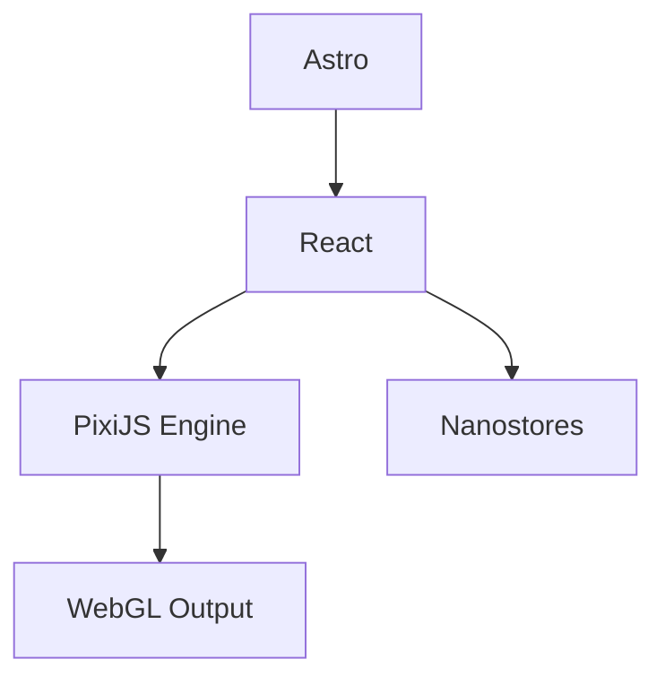

https://github.com/user-attachments/assets/81657547-a143-44ee-b8d7-d5f5446acbec

# [Substrate | Pixi](https://likeablob.github.io/substrate-pixi/)

This is a React + Astro + PixiJS port of the "Substrate" artistic visualization algorithm.

Original implementation: [complexification.net/gallery/machines/substrate/](http://www.complexification.net/gallery/machines/substrate/)

## Gallery

|                                                                     Sub Urban                                                                      |                                                                   Monochrome Ink                                                                   |                                                                    Summer Pool                                                                     |
| :------------------------------------------------------------------------------------------------------------------------------------------------: | :------------------------------------------------------------------------------------------------------------------------------------------------: | :------------------------------------------------------------------------------------------------------------------------------------------------: |
| <video src="https://github.com/user-attachments/assets/add6fbde-3070-472a-84a3-a20e4e289936" autoplay loop muted playsinline width="100%"></video> | <video src="https://github.com/user-attachments/assets/2505f8b0-fa4e-49de-be4c-f76b04222100" autoplay loop muted playsinline width="100%"></video> | <video src="https://github.com/user-attachments/assets/71519a10-ac1d-41b1-866c-a393671f6152" autoplay loop muted playsinline width="100%"></video> |

## Tech Stack



## Setup

```bash
mise trust
mise install
npm ci
```

## Development and Testing

```bash
npm run dev      # Start development server
npm run build    # Build static site
npm run format   # Format code with Prettier
npm run typecheck && npm run lint # Quality checks
npm run test     # Component tests (Storybook + Vitest)
```

## Credits

- Algorithm: Jared Tarbell ([Substrate](http://www.complexification.net/gallery/machines/substrate/))
- Assets: `pollockShimmering.gif` is sourced from the [processing-js repository](https://github.com/jeresig/processing-js/tree/master/examples/custom/data).
